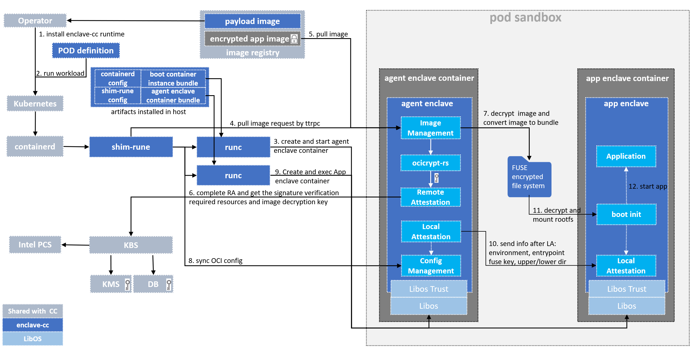

# enclave-cc

## Introduction

Confidential containers are the product of the combination of confidential computing technology and
cloud-native technology. Confidential containers use hardware-based Trusted Execution Environments
(HW-TEE) for resource isolation, data protection, and remote attestation. They can protect data in
execution from cloud service providers and other privileged third parties.

Confidential containers have the following characteristics: they provide confidentiality and
integrity for data, especially for runtime data; they facilitate end-to-end security for the
deployment and operation of sensitive workloads; they provide a way to prove that the environment
in which confidential workloads are launched is authentic and trustworthy; tenants maintain almost
the same experience as using ordinary containers, but can deploy sensitive applications with
greater confidence in their security.

The Confidential Containers project provides a way to protect cloud native applications in a 
HW-TEE without additional modification to the container image during development. HW-TEE-based
confidential container isolation can take two forms: process and virtual machine based isolation.

enclave-cc provides a process-based confidential container solution leveraging Intel SGX. The term
enclave is often associated with process-based isolation.

## Motivation

enclave-CC enables process-based isolation. Process-based isolation is beneficial by drawing the
isolation boundary exactly around each container process. This reduces the Trusted Computing Base,
or the amount of the system your application depends on for security.

Consistent with the VM-based isolation design, the enclave-cc approach does not measure and attest
to the workload (user application). Instead it uses a generic enclave to isolate user's application
from the rest of the system. Measurement and attestation of the empty generic enclave are used in
building trust to deliver the application securely.

The Confidential Containers project, including the enclave-CC approach provides all the elements
for a complete deployment flow, from creating user container image with encryption/signature to
uploading it to an image registry, to pulling the image, verifying its signature and decrypting it,
unpacking it into user rootfs in enclave, then booting up user containers and mounting encrypted
rootfs, all the container processes are isolated with enclaves.

## Design
[Design document](docs/design.md)

## Components and workflow
According to the design and implementation of this project, enclave-cc uses components from cloud
native technology stack, Intel SGX technology stack, and existing key management technology stack
together with its own developed components to deliver a process-based confidential container
solution in the Kubernetes platform with standard cloud native user experience.

Where:
- enclave-agent: enclave-agent is a process inside LibOS inside the enclave. It accepts request 
  from shim-rune and handles image management, attestation, config management, and fuse encrypted
  file system management.
- shim-rune: a standard shim component sits between containerd and runc. It accepts request from
  containerd, starts pause and agent enclave container, asks enclave-agent to perform image
  management actions, and starts agent enclave container. All the containers started by shim-rune
  are all instantiated by runc.
- operator related tools: tools to help to build the enclave-cc payload image for CoCo operator.
  The payload image includes binaries of shim-rune and modified containerd, the image bundles of
  agent enclave container and boot instance, the configurations shim-rune, and the enclave-cc
  runtime deployment script.
- operator: a Kubernetes operator to help install/uninstall enclave-cc runtime in a cloud native way.
- LibOS: Occlum is supported and Gramine in future.
- FUSE encrypted file system: enclave-agent puts decrypted app image into an encrypted fs and later
  referenced by LibOS as rootfs to start app enclave container.

Deployment of enclave-cc runtime:
- deploy of the operator according to [CoCo Operator installation guide](https://github.com/confidential-containers/operator/blob/main/docs/INSTALL.md)
- install enclave-cc runtime according to [Getting started of CoCo](https://github.com/confidential-containers/confidential-containers/blob/main/quickstart.md). This installation process will
  execute enclave-cc runtime [deployment script](https://github.com/confidential-containers/enclave-cc/blob/main/tools/packaging/deploy/enclave-cc-deploy.sh) to: 1) copy shim-rune and containerd binaries into
  host directories 2) copy image bundles of agent enclave container and boot instance to host
  directories 3) copy config of shim-rune to host directory 4) reconfigure containerd to enable
  enclave-cc runtime

After the enclave-cc runtime is successfully installed by the operator, the application workload
can be deployed. Below is the workflow of running an application workload:
- end user defines a POD config yaml to describe the workload and runtime requirements according
  to [the example](https://github.com/confidential-containers/confidential-containers/blob/main/guides/enclave-cc.md#creating-a-sample-coco-workload-using-enclave-cc)
- end user deploys the POD into Kubernetes and the request is propagated to containerd
- shim-rune gets sandbox and container creation request from containerd and creates pause container
- shim-rune creates agent enclave container with runc; runc references OCI spec and rootfs in host
  preinstalled by operator to start the container with LibOS
- shim-rune asks enclave-agent to pull encrypted workload image via TTRPC request
- enclave-agent receives image pull request, verifies the image signature by getting verification
  required resource from KBS after remote attestation
- enclave-agent downloads the image and decrypts the workload image by getting decryption key from KBS
- enclave-agent generates ephemeral key to encrypt the workload image with FUSE encrypted file system
- shim-rune sends collected workload's config to enclave-agent(design ongoing)
- shim-rune creates app enclave container and runs LibOS boot init procedure
- app enclave does local attestation with agent enclave and negotiates information encryption
  method(design/implementation ongoing)
- enclave-agent sends workload's config in encryption to app enclave(design ongoing)
- LibOS boot init procedure receives and decrypts the config; abstracts the fuse key to decrypt the
  FUSE encrypted file system(design ongoing)
- LibOS boot init procedure mounts decrypted workload rootfs, builds workload running config and
  starts app enclave container

## License

